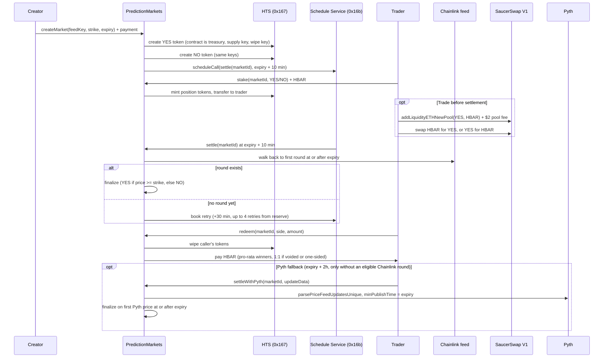
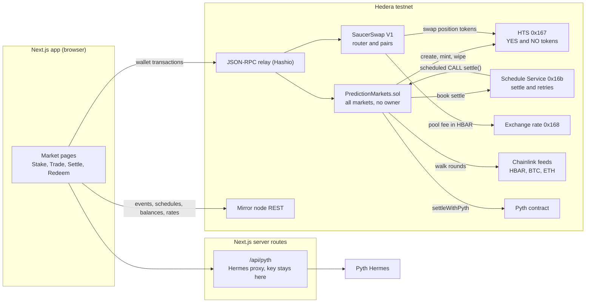

# Predera: prediction markets on Hedera (scaffold-hbar template)

Predera is a template for price prediction markets on Hedera. Someone opens a market such as "Will HBAR/USD be at or above $0.10 on Nov 1?", people stake HBAR on YES or NO and get HTS tokens for their side, and the market settles itself: at creation the contract books its own `settle` call with Hedera's Schedule Service, and the network runs it after expiry against a Chainlink feed. If the feed is late, the contract books retries; after that anyone can settle by hand, use Pyth, or void the market for refunds. There is no keeper bot and no admin key.

```bash
npm create scaffold-hbar@latest -- --template superhbar/prediction-market
```

Live demo on Hedera testnet: [predera.vercel.app](https://predera.vercel.app). It reads the shipped deployment, so you can open a market's settlement timeline and activity log without installing anything. The built-in burner wallet works there too, on testnet only: a fresh burner address is not a Hedera account until it first receives HBAR, so send it testnet HBAR (the footer links the Portal faucet) before staking. Until then the portfolio says so instead of showing balances.


Demo video (100 s, testnet, production build): [docs/predera-demo.mp4](docs/predera-demo.mp4). More screenshots: [an open market with the payout preview](docs/screenshots/market-open.png), [market list](docs/screenshots/markets.png), [create form](docs/screenshots/create.png), [mobile](docs/screenshots/market-detail-mobile.png), [light theme](docs/screenshots/market-detail-light.png). All are taken from the production build against the live testnet deployment.

## What's in it

One contract, `PredictionMarkets.sol`, holds every market. It creates two HTS tokens per market (YES and NO) and keeps the treasury, supply and wipe keys for them, so staking mints tokens and redeeming wipes them without an approve step. It books settlement through the Schedule Service at `0x16b` (HIP-1215) and settles on the first oracle price published at or after expiry, so nobody can bet on a price that is already known.

The Next.js app has a market list, a create form that defaults the strike to the live Chainlink price, a market page (pool split, price chart, stake panel, settlement timeline, activity log with Hashscan links, redeem) and a portfolio page.

Around it: 104 Foundry tests (HTS and the Schedule Service mocked, 100% line coverage of the production contracts: PredictionMarkets 238/238 lines, 89% branches), 67 vitest tests, an end-to-end script that runs the whole lifecycle on testnet, and a Hedera Harness recipe in `.harness/` that one feature of this app was built with.

## What you get that is hard to build alone

- **Markets that settle themselves.** `createMarket` books its own `settle` call with the Hedera Schedule Service (HIP-1215). When the oracle is late, the scheduled call books the next check from the market's own reserve, up to 4 times across the whole 2 hour price window. No keeper bot, no cron server, no admin key. Every step of a real run is linked under [Verified on testnet](#verified-on-testnet).
- **A settlement price nobody can pick.** The contract settles on the first Chainlink round published at or after expiry, and only once it has proven that round is the first: it walks back within the feed phase until it finds a round from before expiry. Pyth is a fallback with the same rule, and only opens when Chainlink provably has no round. `chainlinkSettlementRound` exposes the same check to the UI, so the Settle button appears exactly when the contract would accept it.
- **Native Hedera services doing real work.** Each market creates its own YES and NO HTS tokens, staking mints them and redeeming wipes them with the contract's wipe key, so there is no approve step. Activity, schedules and balances come from the mirror node with Hashscan links on every row.
- **Accounting you can audit.** Payouts come only from recorded pools, a fuzz test proves winners never receive more than the pool, and `withdrawReserve` can only pay out surplus beyond what traders and other markets are owed. A scheduled call never reverts on a handled path, because Hedera bills a reverted scheduled execution anyway.
- **Positions you can trade before settlement.** YES and NO are ordinary HTS tokens, so the market page opens a SaucerSwap V1 pool for either side and buys or sells against it, with quotes from the router and a 1% slippage floor. The pool fee is priced in dollars through Hedera's exchange-rate system contract, and the e2e script opens a pool, buys and sells on testnet. See [Trading before settlement](#trading-before-settlement-saucerswap).
- **Hedera details already measured.** [docs/hedera-notes.md](docs/hedera-notes.md) records what was measured on testnet: tinybar inside the EVM vs weibar in wallets, the 0.65 HBAR first-stake association cost, scheduled-call gas and billing, why `forge script --broadcast` cannot reach Hashio, and the mirror node log filter that silently matches nothing.
- **Proof at every level.** 104 Foundry tests with 100% line coverage of the production contracts, 67 vitest tests, an end-to-end script that runs create, stake, a SaucerSwap pool and trade, scheduled settlement, redeem and reserve withdrawal on real testnet, source verified on Sourcify, CI that scaffolds the template fresh with both npm and yarn, and a [live demo](https://predera.vercel.app).
- **Ready for coding agents.** `AGENTS.md` lists the invariants an agent must not break, and `.harness/` ships a Hedera Harness recipe whose validators pass in freshly scaffolded npm and yarn projects. The market activity panel was built through that recipe.

## Quick start

Prerequisites:

- Node.js >= 20.18.3.
- yarn (default) or npm. If you scaffolded with npm, replace `yarn <script>` below with `npm run <script>`.
- Foundry (`forge`, `cast`) for contract work. The frontend alone does not need it.
- A Hedera testnet account. Use the Hedera Portal (portal.hedera.com, 1000 HBAR per day), not the 10 HBAR per day faucet. Creating a market costs about 23 HBAR in HTS fees plus an 8.5 HBAR settlement reserve.

Run against the shipped testnet deployment (no deploy needed):

```bash
yarn install
yarn next:dev
```

Open http://localhost:3000. The frontend bindings in `packages/nextjs/contracts/deployedContracts.ts` already point at the live testnet deployment, so the app works before you deploy anything. Market 0 shows a finished lifecycle (settled YES after two self-booked retries). Markets 1, 2 and 3 (HBAR, BTC and ETH) stay open until 1 November, 31 October and 16 October 2026, so you can stake on them straight away.

Connect a wallet set to Hedera testnet (chain id 296, RPC https://testnet.hashio.io/api), for example MetaMask with the Hedera network added. For read-only browsing, no wallet is needed: every core route renders without one.

## Deploy your own

Create or import a deployer keystore, then fund its address with testnet HBAR. Sending HBAR to a new EVM address creates its Hedera account automatically.

```bash
yarn foundry:account:generate
yarn foundry:account:import
```

Deploy to Hedera testnet:

```bash
yarn foundry:deploy --network hedera_testnet --keystore <name>
```

Hedera deploys go through `packages/foundry/scripts-js/deployHedera.js` (`cast send --create`), because Foundry 1.8 `forge script` sends `eth_getTransactionCount` with an EIP-1898 block object that the Hashio relay rejects ("Invalid parameter 1"). The script writes the same `broadcast/` and `deployments/` records a forge broadcast would, then `generateTsAbis` regenerates `packages/nextjs/contracts/deployedContracts.ts`. Never edit that file by hand.

Then run the full lifecycle check on testnet (needs about 45 testnet HBAR):

```bash
DEPLOYER_PRIVATE_KEY=0x... yarn foundry:e2e:testnet
```

The script creates a six-minute market, stakes both sides, waits for the scheduled settlement, redeems, withdraws the reserve, and prints a Hashscan link for every step. It takes about 17 minutes when Chainlink publishes a round soon after expiry. Testnet feeds publish only on deviation or heartbeat, so a quiet feed can leave no round for hours. The script then walks the same fallbacks a user has: it waits out the self-booked retries, calls `settle` itself as soon as a round exists (until expiry + 2 hours), settles with Pyth when `PYTH_API_KEY` is set, and voids the market once the 24 hour grace period has passed. When none applies yet it prints the void time; resume with `yarn foundry:e2e:testnet --market <id>`.

## Environment variables

| Name | Where | Required? | Purpose |
|---|---|---|---|
| `NEXT_PUBLIC_HEDERA_TESTNET_RPC_URL` | `packages/nextjs/.env` | No (has a default) | JSON-RPC endpoint the frontend uses on testnet |
| `NEXT_PUBLIC_HEDERA_MAINNET_RPC_URL` | `packages/nextjs/.env` | No (has a default) | JSON-RPC endpoint the frontend uses on mainnet |
| `NEXT_PUBLIC_WALLET_CONNECT_PROJECT_ID` | `packages/nextjs/.env` | No (shared default for local testing; set your own for production) | WalletConnect project id for RainbowKit |
| `PYTH_API_KEY` | `packages/nextjs/.env` | No | Server-only key for the Pyth Hermes proxy at `app/api/pyth`. Without it the app runs fully and the fallback button explains how to enable it |
| `PYTH_HERMES_URL` | `packages/nextjs/.env` | No | Override for the Pyth Hermes endpoint (default https://hermes.pyth.network) |
| `HEDERA_RPC_URL` | `packages/foundry/.env` | No (has a default) | RPC used by fork tests (default https://testnet.hashio.io/api) |
| `LOCALHOST_KEYSTORE_ACCOUNT` | `packages/foundry/.env` | No (has a default) | Keystore used for localhost deploys |
| `DEPLOYER_PRIVATE_KEY` | env, e2e and automation only | Yes, for e2e | Funded testnet ECDSA key consumed by `yarn foundry:e2e:testnet`. Never commit it, never prefix it with `NEXT_PUBLIC_` |

Copy each `.env.example` to `.env` and fill in the values you need. `PYTH_API_KEY` must stay server-side: it is read only by the Next.js API route, never by client code.

## How it works

Every number below was measured on Hedera testnet. The full list, with what each measurement means for the code, is in [docs/hedera-notes.md](docs/hedera-notes.md).



### Market lifecycle

States are `Open`, `Settled`, and `Voided` (see `State` in `PredictionMarkets.sol`). Trading is open until `expiry`. After expiry the market waits for its scheduled settlement, then becomes `Settled` (with outcome YES, NO, or Invalid for one-sided markets) or, after a 24 hour grace period with no settlement, anyone can call `voidMarket` and it becomes `Voided`.

### Why the first round at or after expiry

Testnet Chainlink feeds update every 3 to 46 minutes (measured). The latest price at expiry can therefore be published before trading closes, which would let traders bet on a known outcome. Both oracle paths settle on the first price published at or after expiry: the contract excludes pre-expiry publications, so a price that was already known before expiry cannot settle the market.

The contract only settles on a Chainlink round it can prove is first: walking back from the latest round, it must reach an earlier round of the same phase published before expiry. If the walk stops first (its 48-step bound, a phase boundary, a missing round), it reports no eligible round instead of guessing, and the market moves on to a retry, the Pyth fallback, or voiding.

### Self-scheduling and retries (HIP-1215)

At creation the contract books `settle(marketId)` as a scheduled call for expiry plus 10 minutes through the Schedule Service at `0x16b`. Inside a scheduled call, `msg.sender` equals the contract itself, which is how `settle` knows it was invoked by the network. If no Chainlink round exists at or after expiry yet, the scheduled call books its own retry (plus 30 minutes, up to 4 retries, so checks run at +10, +40, +70, +100 and +130 minutes and cover the whole 2 hour round window) from the market's reserve instead of reverting. Anyone can also call `settle` directly once a round exists.

### Pyth fallback and voiding

Chainlink always has precedence, so nobody can choose whichever oracle favours their side. `settleWithPyth` opens 2 hours after expiry (`maxRoundLag`, when no later Chainlink round can still qualify), and only if no provably first Chainlink round exists; otherwise it reverts with `ChainlinkRoundAvailable`. It uses `parsePriceFeedUpdatesUnique` with `minPublishTime` set to expiry, so only the first Pyth price at or after expiry is accepted. The caller pays the Pyth update fee from `msg.value`; excess is refunded. After the 24 hour grace period, anyone can void an unsettled market and every position refunds 1:1.

Rounds more than 2 hours after expiry are rejected (`maxRoundLag`), so a market cannot settle on a price from hours later.

### Position tokens and redeem

Each market has a YES token and a NO token: HTS fungible tokens with 8 decimals, created by the contract, which holds treasury, supply key, and wipe key. Staking mints tokens equal to `msg.value` and transfers them to the staker. Redeem wipes the caller's tokens with the wipe key (HTS `burnToken` only burns from the treasury, so wiping is the correct primitive) and pays HBAR in the same transaction, with no approve step.

Payout equals `amount * totalPool / winningPool` and is read from the contract's `quotePayout`: the redeem amount the frontend shows is the number the contract pays. Before you stake, the form previews what the stake would pay if its side won at current pool sizes (`projectedPayout` in `utils/markets/units.ts`, the same formula); later stakes move that number. One-sided markets (only YES or only NO staked) and voided markets refund 1:1. Rounding dust from integer division stays in the contract.

### Trading before settlement (SaucerSwap)

Staking is parimutuel: your HBAR joins the market's YES or NO pool and stays there until settlement. Because the position tokens are plain HTS tokens, anyone can also trade them on SaucerSwap V1, Hedera's main DEX, at any time before settlement. The contract is not involved: whoever holds a token when the market settles redeems it.

- **Open a pool.** A holder of YES (or NO) tokens deposits tokens and HBAR with the router's `addLiquidityETHNewPool`. The deposit ratio sets the starting price, and the depositor receives the pool's LP token. SaucerSwap charges a fixed $2 pool fee: the factory reports it in tinycents (`pairCreateFee`) and the Hedera exchange-rate system contract (`0x168`, `tinycentsToTinybars`) converts it to HBAR, 19.66 HBAR when measured.
- **Buy or sell.** The trade panel on the market page finds the pool through `factory.getPair(token, WHBAR)`, shows its price and reserves, quotes with the router's `getAmountsOut` and swaps with `swapExactETHForTokens` or `swapExactTokensForETH` at a 1% slippage floor. Selling needs an `approve` on the token first (HTS tokens have an ERC-20 facade).
- **Two prices that mean different things.** The pool share on the market page is how the staked HBAR is split. The SaucerSwap price is what traders pay for a token right now, after weighing the odds and the payout per token.

Measured on testnet (`yarn foundry:e2e:testnet` runs all three steps):

| Step | Gas used | Notes |
|---|---|---|
| Open a pool | 6.79M | SaucerSwap's docs suggest 3.2M; that runs out inside the LP token association. The app sends 8M. |
| Buy (HBAR to YES) | 0.18M | |
| Sell (YES to HBAR) | 0.87M | Includes unwrapping WHBAR. |

Pair paths use the WHBAR token `0.0.15058`; the router's `WHBAR()` returns the wrapper contract `0.0.15057`, which is not the token in the pair. Addresses live in `packages/nextjs/utils/markets/saucerswap.ts`.

### How payouts work

Staking is parimutuel, not an order book: one position token is minted per HBAR staked, whatever the pool split, and winners share the whole pool. Payout equals `amount * totalPool / winningPool`, quoted on chain by `quotePayout`. Worked example from market 0 on testnet (5 HBAR staked on YES, 3 HBAR on NO, settled YES): the YES staker redeemed 5 * 8 / 5 = 8 HBAR and the NO stake paid 0. If only one side has stakes, or the market is voided, every position redeems 1:1 for the HBAR staked.


A position token is not a fixed 1 HBAR claim: its value at settlement depends on how the pool ends up split. That is why the stake panel labels its "pays if this side wins" figure as an estimate, and why a SaucerSwap price for a token can sit above 1 HBAR.

### Units (tinybar vs weibar)

Wallets and JSON-RPC send weibar (18 decimals). Inside the EVM, `msg.value` and balances are tinybar (8 decimals); the relay converts. The contract never rescales. The frontend converts at one boundary in `packages/nextjs/utils/markets/units.ts`: it sends value with `parseEther(hbar)` and formats contract amounts with 8 decimals.

### Fees and the reserve

The network bills the contract for scheduled executions (a settle measured 127k gas, 0.104 HBAR at 82 tinybar per gas) and retry bookings (about 1.17 HBAR). Each market keeps its own reserve: 0.5 HBAR is charged per scheduled execution and 1.5 HBAR per retry. Creation requires at least 8.5 HBAR of reserve after the two HTS creation fees (about 23 HBAR total at the measured rate of $1 = 9.61 HBAR).

`totalPoolLiability` tracks HBAR owed to traders and `totalReserves` tracks the sum of market reserves, so `withdrawReserve` pays only the surplus beyond trader pools and other markets' reserves. If fees were underestimated, the shortfall reduces what that market's creator can withdraw.

If someone settles a market by hand before its booked schedule fires, the schedule still runs later and is still billed. So while a schedule is pending (`schedulePending`), `withdrawReserve` keeps one execution's cost (0.5 HBAR) in the reserve; the scheduled call returns quietly on a closed market, pays for itself from that holdback, and the creator can withdraw anything left afterwards.

## Architecture



The contract talks to three Hedera system contracts and two oracles; the browser only needs the relay, the mirror node and, for the Pyth fallback, the server route. SaucerSwap sits beside the contract rather than inside it: the contract never calls the DEX, so a pool problem cannot block settlement or redeem.

```text
packages/foundry/
  contracts/PredictionMarkets.sol   One contract, all markets; treasury, supply key, wipe key
  contracts/libraries/PriceMath.sol Price normalization (Chainlink decimals, Pyth expo to 1e18)
  contracts/interfaces/             IAggregatorV3, IPyth, IHederaScheduleService, IHtsWipe
  script/Deploy.s.sol               Builds the deploy with HelperConfig; also encodes constructor args for deployHedera.js
  script/HelperConfig.s.sol         Single source for feeds (HBAR/BTC/ETH, testnet and mainnet) and timing config
  script/DeployHelpers.s.sol        Scaffold deploy runner
  test/PredictionMarkets.t.sol      State machine, oracles, payouts, reserve accounting, fuzz tests
  test/PriceMath.t.sol              Price normalization unit tests
  test/HelperConfig.t.sol           Feed and config tests per chain
  test/mocks/                       MockHTS, MockHSS (etched at 0x167/0x16b), MockAggregator, MockPyth
  scripts-js/deployHedera.js        Testnet and mainnet deploy via cast send --create (see Deploy your own)
  scripts-js/e2eTestnet.js          Full lifecycle run on real testnet with Hashscan links
  scripts-js/generateTsAbis.js      Regenerates packages/nextjs/contracts/deployedContracts.ts
packages/nextjs/
  app/page.tsx                      Market list with state filters
  app/markets/new/page.tsx          Create form, live Chainlink price as strike default
  app/markets/[id]/page.tsx         Market detail: pools, odds, countdowns, stake, settle, void, redeem
  app/portfolio/page.tsx            Positions across markets
  app/api/pyth/route.ts             Server-only Hermes proxy; PYTH_API_KEY never reaches the browser
  components/markets/               MarketCard, StakePanel, TradePanel (SaucerSwap), RedeemPanel, OddsBar, Countdown, PriceChart, SettlementTimeline, ActivityPanel, States, ui (shared badges and bars)
  styles/globals.css                Both daisyUI themes and the YES/NO colors: the whole look in one file
  utils/brand.ts                    App name, description and the theme colors that CSS cannot reach
  hooks/markets/                    useMarket, useMarkets, usePositions, useSaucerPool, useAccountExists, useMarketConfig, useChainlinkHistory, useScheduleStatus, useFeedInfo, useCreationEstimate, useMarketActivity
  hooks/scaffold-hbar/              Scaffold read, write, event, and transactor hooks
  utils/markets/units.ts            The single tinybar and weibar conversion boundary, plus frontend gas limits
  utils/markets/feeds.ts            Feed keys and bytes32 conversion
  utils/markets/saucerswap.ts       SaucerSwap V1 addresses, ABIs, pool price and slippage helpers
  utils/markets/status.ts           Derives UI status (open, awaiting-settlement, retrying (shown as Resolving), settle-available, voidable, settled, voided)
  utils/markets/mirror.ts           Mirror node REST reads (exchange rate, account, token association, schedule status, contract logs)
  utils/markets/activity.ts         Decodes PredictionMarkets event logs into the activity panel rows
  utils/markets/hashscan.ts         Hashscan and entity id link builders
.harness/                           Harness recipe: spec, PRDs, validators (see Using Hedera Harness)
docs/hedera-notes.md                Hedera behaviour measured on testnet (units, HTS, HIP-1215, oracles, SaucerSwap, tooling)
docs/TUTORIAL.md                    Worked extension: add a creator fee from contract to deploy
docs/img/payoff.svg                 Payout diagram used in How payouts work
docs/screenshots/                   Screenshots of the production build against the testnet deployment
```

## Testing

```bash
yarn foundry:test
yarn next:test
```

`yarn foundry:test` runs 104 unit tests. HTS and the Schedule Service are mocked with `vm.etch` at `0x167` and `0x16b`, Chainlink and Pyth use mocks, and a fuzz test proves winners never exceed the pool. Line coverage is 100 percent for the production contracts (PredictionMarkets 238/238 lines, 89% branches). `hedera-forking` does not emulate the Schedule Service, which is why HSS is mocked and the e2e script runs on real testnet instead.

`yarn next:test` runs vitest for units (including the pre-stake payout preview), feeds, status, Hashscan helpers, the SaucerSwap price and slippage math, and the HBAR price conversion. Redeem amounts come from the contract's own `quotePayout`.

Before pushing, also run the type and build gates:

```bash
yarn next:lint
yarn next:check-types
yarn next:build
```

## Verified on testnet

Live deployment: `PredictionMarkets` at `0x45F344b4ce70B90BDC6e439559e6160B23c5AcED` ([Hashscan](https://hashscan.io/testnet/contract/0x45F344b4ce70B90BDC6e439559e6160B23c5AcED)), source verified on Sourcify (exact match). It checks for a settlement price 4 times after the first scheduled call, 30 minutes apart, and ships with 8 demo markets on HBAR, BTC and ETH.

The settlement logic below was proven on the two previous deployments, which used a shorter retry schedule (3 retries, 15 minutes apart):

- `0x1768f713...6ac7`, 2026-10-03: the HBAR/USD feed stayed quiet for 79 minutes after expiry, past the last retry. All three scheduled checks returned without reverting, then a manual `settle` closed the market YES once the round landed ([settlement](https://hashscan.io/testnet/transaction/0x52b2f2e9ec697b4f2e223e917bee70c4b8242b270fb3dea875ab9669bf6a6daa), [redeem](https://hashscan.io/testnet/transaction/0x1da9cc0361a83a53d2cf03d690ca679ce083617568bd2ef455eb7a00107b79db), [reserve withdrawal](https://hashscan.io/testnet/transaction/0xbc1aea6a8e4475437ecf5ad395f0bf300551346936d05b354fd88609273eab74)). That run is why the current deployment checks across the whole 2 hour window.
- `0x9b2A8977...516E`, 2026-10-03, market 0: the scheduled call found no round, booked a retry, the retry booked another, and that one settled the market on its own:

| Time (UTC) | Step | Evidence |
|---|---|---|
| 06:43 | Create market 0, which creates both HTS tokens and books the settlement | [transaction](https://hashscan.io/testnet/transaction/0x71be2b4dfb442e0430879625f98900125be3a9f87b0f344d7994d76a04432fb0), YES [0.0.10838209](https://hashscan.io/testnet/token/0.0.10838209), NO [0.0.10838210](https://hashscan.io/testnet/token/0.0.10838210) |
| 06:44 | Stake 5 HBAR on YES and 3 HBAR on NO | [YES](https://hashscan.io/testnet/transaction/0x5fb46067ef32ab8c61bb0590d22d7f1727ed09ff0875d9f4920f6f2fabe610d2), [NO](https://hashscan.io/testnet/transaction/0x8a3996ba8b497770cc32c9b303f3c0e696fc41d9abb90ef6d23a097d6fc9dee1) |
| 06:49 | Expiry | |
| 06:59 | Network runs the booked call; no round after expiry yet, so it books a retry | [schedule 0.0.10838211](https://hashscan.io/testnet/schedule/0.0.10838211), [retry booking](https://hashscan.io/testnet/transaction/0x2c96a45731d83d83a1579f50151c80492327fb59a199342e77d470f56aef6ff6) |
| 07:14 | First retry runs; still no round, books the second | [schedule 0.0.10838392](https://hashscan.io/testnet/schedule/0.0.10838392), [retry booking](https://hashscan.io/testnet/transaction/0xe1fc33fd545b6e08791e97c2c37499796a165c143d31ac00141c5ca59bb55a7a) |
| 07:29 | Second retry settles YES at $0.10062165, on a Chainlink round published 1960 s after expiry | [schedule 0.0.10838549](https://hashscan.io/testnet/schedule/0.0.10838549), [settlement](https://hashscan.io/testnet/transaction/0xefda2487d6298b82ccc1ac0d390dc404b21497160f8bb2a37c9e551d4d0afb8c) |
| 07:29 | Redeem the winning YES tokens for the whole 8 HBAR pool | [transaction](https://hashscan.io/testnet/transaction/0x220a02113834eb25b8b84cd8dc36a49809896afb3c5ebbc0f8519e94a954c335) |
| 07:29 | Creator withdraws what is left of the reserve | [transaction](https://hashscan.io/testnet/transaction/0x0566f04c6db8c45b637273eecc1b39d81a255f8ed656ae1051ec825fbb487478) |

Earlier deployments are kept as history. `0x0cc41d22...B3d2` found the bug fixed in the current one: when its last retry still had no round, `settle` reverted, which left the market marked as retrying and charged the run to the pooled HBAR instead of the market's reserve. `0x5863781b...105b` ran the first full lifecycle on 2026-10-02 (one retry, settled NO).

## Make it yours

Names, colors and images live in a few files, so a fork can rebrand without touching components.

| What | Where |
|---|---|
| Name, short name, description | `packages/nextjs/utils/brand.ts` (`BRAND`), used by the header, page metadata, web app manifest and wallet modal |
| Colors, radii, fonts | `packages/nextjs/styles/globals.css`: the dark `hedera` theme (default), the `hedera-light` theme, and the `--yes` / `--no` outcome colors under each theme |
| Font families | `packages/nextjs/app/layout.tsx` (`next/font` Manrope and IBM Plex Mono); swap them and keep the CSS variable names |
| Logo and coin icons | `packages/nextjs/public/logo.png` (header, favicon, app icons) and `public/coins/*.svg`, mapped in `ASSET_ICONS` in `brand.ts` |

Components only use semantic classes (`bg-base-100`, `text-primary`, `bg-yes`, `text-no`, `.panel`), never raw hex values, so editing a theme recolors every page, including the price chart, which draws with `var(--color-primary)`. Page width and spacing come from the `.shell` and `.page` classes in the same file. Shared market UI (asset badge, status pill, YES/NO bar) lives in `packages/nextjs/components/markets/ui.tsx`.

Common changes:

- New palette: change `--color-primary` and the base colors in both themes, then the matching hex values in `BRAND`.
- Light mode by default: set `defaultTheme="hedera-light"` on the `ThemeProvider` in `app/layout.tsx` and move `default: true` to the light theme in `globals.css`.
- Other assets: add a feed (see Add a price feed below). The question wording comes from `marketQuestion` in `packages/nextjs/utils/markets/question.ts`.

## Extending the template

[docs/TUTORIAL.md](docs/TUTORIAL.md) walks one extension end to end: scaffold, follow a market through its life, add a 1% creator fee across contract, config, tests and frontend, then deploy and prove it on testnet. The recipes below are the short versions.

### Add a price feed

1. Add the Chainlink address and Pyth price id in `packages/foundry/script/HelperConfig.s.sol` (`buildFeedKeys`, `buildFeeds`).
2. Add the key to `FEED_KEYS` in `packages/nextjs/utils/markets/feeds.ts`.
3. Redeploy (`yarn foundry:deploy --network hedera_testnet --keystore <name>`). Feeds are immutable after deploy, so existing markets keep the old set.

### Change the payout model

1. Change `quotePayout` in `packages/foundry/contracts/PredictionMarkets.sol`. It is the single payout definition: `redeem` pays exactly what it quotes.
2. Keep the invariant: total winner payouts never exceed `yesPool + noPool`. Extend the fuzz test in `packages/foundry/test/PredictionMarkets.t.sol` (`testFuzz_WinnersNeverExceedPool`) for the new math.
3. Redeem amounts in the frontend already come from `quotePayout`. Update the pre-stake preview, `projectedPayout` in `packages/nextjs/utils/markets/units.ts`, to the same formula, and its test in `units.test.ts`.

### Add a creator fee

1. Skim the fee in `stake` (grow the market reserve or a recorded fee balance, not a separate transfer).
2. Keep `totalPoolLiability` equal to HBAR owed to traders only, so `withdrawReserve` accounting still protects pools.
3. Surface the fee in the create form estimate (`packages/nextjs/hooks/markets/useCreationEstimate.ts`) and document it next to the reserve.

## Troubleshooting

| Symptom | Cause | Fix |
|---|---|---|
| `forge script` fails with "Invalid parameter 1" | Foundry 1.8 sends `eth_getTransactionCount` with an EIP-1898 block object that Hashio rejects | Deploy with `yarn foundry:deploy --network hedera_testnet --keystore <name>`, which routes through `scripts-js/deployHedera.js` (`cast send --create`) |
| Stake or create reverts with `INSUFFICIENT_GAS` or runs out of gas | Hashio gas estimation is unreliable for HTS and HSS calls | Use the explicit gas limits in `packages/nextjs/utils/markets/units.ts`: createMarket 3M, stake 1.5M, settle and settleWithPyth 1M, redeem 800k, voidMarket and withdrawReserve 300k |
| "Live price is unavailable" on the create form | Chainlink read failed or the feed address is wrong for the connected network | Check the network (testnet 296, mainnet 295), compare the address with `packages/foundry/script/HelperConfig.s.sol`, and retry. Creation still works with a manual strike |
| Market stuck awaiting settlement | No Chainlink round at or after expiry exists yet, or retries ran out | Wait for the next retry, call `settle` once a round exists, or use the Pyth fallback. After the 24 hour grace period anyone can void |
| "Settle with Pyth" button disabled or explains setup | `PYTH_API_KEY` is not set (Hermes requires an API key since 2026-08-26) | Set `PYTH_API_KEY` in `packages/nextjs/.env` and retry. Chainlink settlement and voiding work without it |
| Stake reverts with `TokenTransferFailed(184)` | Response code 184 is `TOKEN_NOT_ASSOCIATED_TO_ACCOUNT`: the staker's account has no free auto-association slot and is not associated with the position token | Use the one-click association prompt in the stake panel, then stake again. First stake per token per account costs about 0.65 HBAR (auto-association) versus about 0.04 HBAR normally |
| Balance too low after using the faucet | The faucet gives 10 HBAR per day; a market needs about 23 HBAR in token fees plus an 8.5 HBAR reserve | Get a Hedera Portal testnet account (portal.hedera.com, 1000 HBAR per day) |
| Wallet is on the wrong network | MetaMask points at mainnet or a local node while the app targets testnet | Switch the wallet to Hedera testnet (chain id 296, RPC https://testnet.hashio.io/api) and reload |

## Using Hedera Harness

[Hedera Harness](https://github.com/hedera-dev/hedera-harness) runs a coding agent against a recipe and only accepts the result when deterministic validators pass. This template ships its recipe in `.harness/`, and the market activity panel on every market page was built with it.

| File | What it does |
|---|---|
| `.harness/spec.yaml` | Recipe (schema v2): agent, baseline commands, validators, Tier 3 contract, Tier 3.5 chain validation |
| `.harness/prds/01-market-activity.md` | The feature brief, including the mirror node facts the agent needs (filter logs by `topics[1]` on the client) |
| `.harness/validators/static.json` | Tier 0: docs, forbidden env files, required feature files. Holds in a freshly scaffolded project, where `template.json` is already gone |
| `.harness/validators/yarn.json` | Tier 1: install, lint, type-check, vitest, forge tests, production build. Each runs through `command.cjs`, which picks yarn or npm from `package.json` (the file keeps the Harness default name) |
| `.harness/validators/playwright-smoke.yaml` | Tier 2: boots the app on port 20960 (`PORT` overrides) and loads `/`, `/markets/0`, `/markets/new`, `/portfolio` and a missing market with zero console errors. `/debug` is excluded: the upstream debug-contracts package calls CoinGecko itself |
| `.harness/acceptance-contract.json` | Tier 3: five numbered assertions graded against market 0's real testnet history |

Check the recipe and run the cheap tiers (no agent, no keys):

```bash
npx playwright@1.63.0 install chromium   # once, for the Tier 2 browser
yarn harness:doctor
yarn harness:validate
```

`harness:doctor` lists every missing piece for a full run (agent CLI, optional packages, operator env). `harness:validate` runs Tiers 0 to 2 and passes on `main`.

A full run needs the Tier 2 and Tier 3.5 extras next to the CLI, an agent CLI (`claude` by default), and an ECDSA testnet operator that funds a throwaway signer and gets the HBAR swept back at the end:

```bash
npm i -g hedera-harness@1.2.2 playwright @hiero-ledger/sdk
export HEDERA_OPERATOR_ID=0.0.xxxxx HEDERA_OPERATOR_KEY=0x...
hedera-harness run
```

### How the activity panel was built

The Harness spec and validators for that feature are in `.harness/`.

Tier 3 acceptance contract, graded by hand. C1, C2 and C4 were re-graded on 2026-10-03 against market 0 of the current deployment; C3 and C5 were graded on the deployment the run used (`0x5863781b...105b`) and do not depend on which market is checked.

| Id | Assertion | Result |
|---|---|---|
| C1 | Market 0 lists created, two stakes, two retries booked, settled YES, redeemed, reserve withdrawn, newest first, with correct amounts | Pass: 8 entries, 5 and 3 HBAR |
| C2 | Each entry links to the transaction that emitted it | Pass: every hash matches the mirror node logs, settlement is `0xefda2487...` |
| C3 | Loading and error states, page keeps working | Pass by code review (skeleton, error with Retry, failures stay inside the panel) |
| C4 | Existing routes and the resolution strip still render | Pass ("Resolved YES") |
| C5 | A new stake appears after a real transaction | Pass with the deployer as signer: [stake on market 1](https://hashscan.io/testnet/transaction/0x8b508cde06355e3acbc1e6f5439ef0b5048373f039e7fcbcd0122a94e841618e) showed up on refresh |

## Disclaimer

Unaudited and educational. Built testnet-first for learning the HTS, HIP-1215 scheduling, and oracle settlement pattern. Do not use with real funds or deploy to mainnet without a professional audit. Mainnet oracle addresses in `HelperConfig.s.sol` are present for reference only.

## License

MIT. See [LICENCE](LICENCE).
