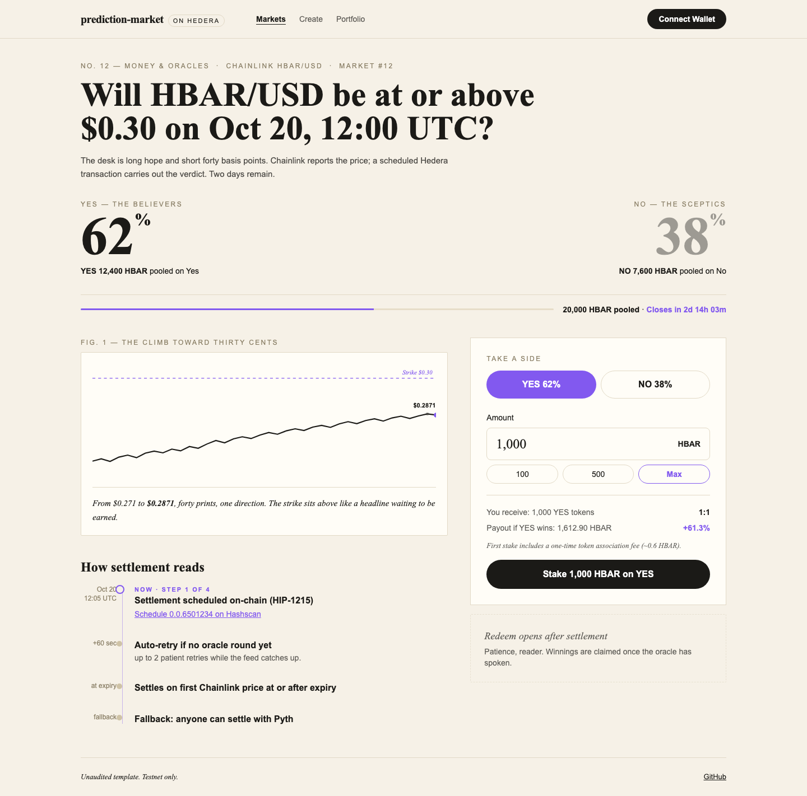
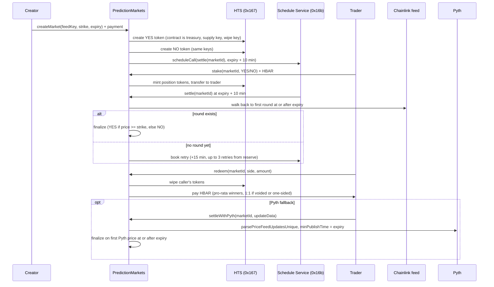

# Prediction Market (scaffold-hbar template)

Binary price prediction markets on Hedera. Anyone creates a market (for example "HBAR/USD at or above $0.30 at expiry"), traders stake HBAR on YES or NO and receive HTS position tokens, and the market settles itself through a scheduled contract call that reads a Chainlink feed. A Pyth fallback and a void path cover the failure cases. No keeper bot, no cron job.

```bash
npm create scaffold-hbar@latest -- --template superhbar/prediction-market
```



## What you get

- `PredictionMarkets` contract: one contract holds every market and acts as treasury, supply key, and wipe key for all position tokens.
- HIP-1215 self-settlement: each market books its own `settle(marketId)` call on the Hedera Schedule Service (system contract `0x16b`) at creation, with self-booked retries.
- Chainlink push settlement plus Pyth pull fallback: settlement uses the first oracle price at or after expiry, never a cherry-picked price.
- HTS position tokens: one fungible token per side per market (8 decimals), minted 1:1 per staked tinybar, redeemed by wipe (no approve step).
- Frontend pages: market list with filters, create form with live Chainlink strike default, market detail (pools, odds, countdowns, stake, settle, void, redeem), portfolio, and the scaffold Debug Contracts page.
- Tests: 78 Foundry unit tests with mocked HTS and Schedule Service, plus vitest coverage for units, feeds, status, and Hashscan helpers.
- E2E script: full lifecycle on real testnet (create, stake both sides, scheduled settle, redeem, reserve withdraw) that prints Hashscan links.
- Harness recipe: `.harness/` holds a spec, PRDs, and validators so Hedera Harness can build features against the same gate.

## Quick start

Prerequisites:

- Node.js >= 20.18.3.
- yarn (default) or npm. If you scaffolded with npm, replace `yarn <script>` below with `npm run <script>`.
- Foundry (`forge`, `cast`) for contract work. The frontend alone does not need it.
- A Hedera testnet account. Use the Hedera Portal (portal.hedera.com, 1000 HBAR per day), not the 10 HBAR per day faucet. Creating a market costs about 23 HBAR in HTS fees plus a 7 HBAR settlement reserve.

Run against the shipped testnet deployment (no deploy needed):

```bash
yarn install
yarn next:start
```

Open http://localhost:3000. The frontend bindings in `packages/nextjs/contracts/deployedContracts.ts` already point at the live testnet deployment, so the app works before you deploy anything.

Connect a wallet set to Hedera testnet (chain id 296, RPC https://testnet.hashio.io/api), for example MetaMask with the Hedera network added. For read-only browsing, no wallet is needed: every core route renders without one.

## Deploy your own

Create or import a deployer keystore (the address must be a Hedera-created account, funded through the Portal):

```bash
yarn foundry:account:generate
yarn foundry:account:import
```

Deploy to Hedera testnet:

```bash
yarn foundry:deploy --network hedera_testnet --keystore <name>
```

Hedera deploys go through `packages/foundry/scripts-js/deployHedera.js` (`cast send --create`), because Foundry 1.8 `forge script` sends `eth_getTransactionCount` with an EIP-1898 block object that the Hashio relay rejects ("Invalid parameter 1"). The script writes the same `broadcast/` and `deployments/` records a forge broadcast would, then `generateTsAbis` regenerates `packages/nextjs/contracts/deployedContracts.ts`. Never edit that file by hand.

Then run the full lifecycle check on testnet (about 17 minutes, needs about 45 testnet HBAR):

```bash
DEPLOYER_PRIVATE_KEY=0x... yarn foundry:e2e:testnet
```

The script creates a short market, stakes both sides, waits for the scheduled settlement, redeems the winner, withdraws the reserve, and prints a Hashscan link for every step.

## Environment variables

| Name | Where | Required? | Purpose |
|---|---|---|---|
| `NEXT_PUBLIC_HEDERA_TESTNET_RPC_URL` | `packages/nextjs/.env` | No (has a default) | JSON-RPC endpoint the frontend uses on testnet |
| `NEXT_PUBLIC_HEDERA_MAINNET_RPC_URL` | `packages/nextjs/.env` | No (has a default) | JSON-RPC endpoint the frontend uses on mainnet |
| `NEXT_PUBLIC_WALLET_CONNECT_PROJECT_ID` | `packages/nextjs/.env` | Yes, for wallet connect | WalletConnect project id for RainbowKit |
| `PYTH_API_KEY` | `packages/nextjs/.env` | No | Server-only key for the Pyth Hermes proxy at `app/api/pyth`. Without it the app runs fully and the fallback button explains how to enable it |
| `PYTH_HERMES_URL` | `packages/nextjs/.env` | No | Override for the Pyth Hermes endpoint (default https://hermes.pyth.network) |
| `HEDERA_RPC_URL` | `packages/foundry/.env` | No (has a default) | RPC used by fork tests (default https://testnet.hashio.io/api) |
| `LOCALHOST_KEYSTORE_ACCOUNT` | `packages/foundry/.env` | No (has a default) | Keystore used for localhost deploys |
| `DEPLOYER_PRIVATE_KEY` | env, e2e and automation only | Yes, for e2e | Funded testnet ECDSA key consumed by `yarn foundry:e2e:testnet`. Never commit it, never prefix it with `NEXT_PUBLIC_` |

Copy each `.env.example` to `.env` and fill in the values you need. `PYTH_API_KEY` must stay server-side: it is read only by the Next.js API route, never by client code.

## How it works



### Market lifecycle

States are `Open`, `Settled`, and `Voided` (see `State` in `PredictionMarkets.sol`). Trading is open until `expiry`. After expiry the market waits for its scheduled settlement, then becomes `Settled` (with outcome YES, NO, or Invalid for one-sided markets) or, after a 24 hour grace period with no settlement, anyone can call `voidMarket` and it becomes `Voided`.

### Why the first round at or after expiry

Testnet Chainlink feeds update every 3 to 46 minutes (measured). The latest price at expiry can therefore be published before trading closes, which would let traders bet on a known outcome. Both oracle paths settle on the first price published at or after expiry, so the settlement price is always unknowable while trading is open.

### Self-scheduling and retries (HIP-1215)

At creation the contract books `settle(marketId)` as a scheduled call for expiry plus 10 minutes through the Schedule Service at `0x16b`. Inside a scheduled call, `msg.sender` equals the contract itself, which is how `settle` knows it was invoked by the network. If no Chainlink round exists at or after expiry yet, the scheduled call books its own retry (plus 15 minutes, up to 3 retries) from the market's reserve instead of reverting. Anyone can also call `settle` directly once a round exists.

### Pyth fallback and voiding

`settleWithPyth` is callable by anyone after expiry while the market is neither settled nor voided. It uses `parsePriceFeedUpdatesUnique` with `minPublishTime` set to expiry, so only the first Pyth price at or after expiry is accepted and a late settler cannot pick a favorable price. The caller pays the Pyth update fee from `msg.value`; excess is refunded. After the 24 hour grace period, anyone can void an unsettled market and every position refunds 1:1.

Rounds more than 2 hours after expiry are rejected (`maxRoundLag`), so a market cannot settle on a price from hours later.

### Position tokens and redeem

Each market has a YES token and a NO token: HTS fungible tokens with 8 decimals, created by the contract, which holds treasury, supply key, and wipe key. Staking mints tokens equal to `msg.value` and transfers them to the staker. Redeem wipes the caller's tokens with the wipe key (HTS `burnToken` only burns from the treasury, so wiping is the correct primitive) and pays HBAR in the same transaction, with no approve step.

Payout equals `amount * totalPool / winningPool` and is read from the contract's `quotePayout`: the number the frontend shows is the number the contract pays. One-sided markets (only YES or only NO staked) and voided markets refund 1:1. Rounding dust from integer division stays in the contract.

### Units (tinybar vs weibar)

Wallets and JSON-RPC send weibar (18 decimals). Inside the EVM, `msg.value` and balances are tinybar (8 decimals); the relay converts. The contract never rescales. The frontend converts at one boundary in `packages/nextjs/utils/markets/units.ts`: it sends value with `parseEther(hbar)` and formats contract amounts with 8 decimals.

### Fees and the reserve

The network bills the contract for scheduled executions (a settle measured 127k gas, 0.104 HBAR at 82 tinybar per gas) and retry bookings (about 1.17 HBAR). Each market keeps its own reserve: 0.5 HBAR is charged per scheduled execution and 1.5 HBAR per retry. Creation requires at least 7 HBAR of reserve after the two HTS creation fees (about 23 HBAR total at the measured rate of $1 = 9.61 HBAR).

`totalPoolLiability` tracks HBAR owed to traders and `totalReserves` tracks the sum of market reserves, so `withdrawReserve` never pays out of trader pools. A fee underestimate is absorbed by that market's creator, never by traders.

## Architecture

```text
packages/foundry/
  contracts/PredictionMarkets.sol   One contract, all markets; treasury, supply key, wipe key
  contracts/libraries/PriceMath.sol Price normalization (Chainlink decimals, Pyth expo to 1e18)
  contracts/interfaces/             IAggregatorV3, IPyth, IHederaScheduleService, IHtsWipe
  script/Deploy.s.sol               Deploys PredictionMarkets with HelperConfig (used on localhost)
  script/HelperConfig.s.sol         Single source for feeds (HBAR/BTC/ETH, testnet and mainnet) and timing config
  script/DeployHelpers.s.sol        Scaffold deploy runner
  test/PredictionMarkets.t.sol      State machine, oracles, payouts, reserve accounting, fuzz tests
  test/PriceMath.t.sol              Price normalization unit tests
  test/HelperConfig.t.sol           Feed and config tests per chain
  test/mocks/                       MockHTS, MockHSS (etched at 0x167/0x16b), MockAggregator, MockPyth
  scripts-js/deployHedera.js        Testnet and mainnet deploy via cast send --create (see Deploy your own)
  scripts-js/e2eTestnet.js          Full lifecycle run on real testnet with Hashscan links
  scripts-js/generateTsAbis.js      Regenerates packages/nextjs/contracts/deployedContracts.ts
packages/nextjs/
  app/page.tsx                      Market list with state filters
  app/markets/new/page.tsx          Create form, live Chainlink price as strike default
  app/markets/[id]/page.tsx         Market detail: pools, odds, countdowns, stake, settle, void, redeem
  app/portfolio/page.tsx            Positions across markets
  app/api/pyth/route.ts             Server-only Hermes proxy; PYTH_API_KEY never reaches the browser
  components/markets/               MarketCard, StakePanel, RedeemPanel, OddsBar, Countdown, PriceChart, SettlementTimeline, States
  hooks/markets/                    useMarket, useMarkets, usePositions, useMarketConfig, useChainlinkHistory, useScheduleStatus, useFeedInfo, useCreationEstimate
  hooks/scaffold-hbar/              Scaffold read, write, event, and transactor hooks
  utils/markets/units.ts            The single tinybar and weibar conversion boundary, plus frontend gas limits
  utils/markets/feeds.ts            Feed keys and bytes32 conversion
  utils/markets/status.ts           Derives UI status (open, awaiting-settlement, retrying, settle-available, voidable, settled, voided)
  utils/markets/mirror.ts           Mirror node REST reads (schedule status, event history)
  utils/markets/hashscan.ts         Hashscan and entity id link builders
.harness/                           Harness recipe: spec, PRDs, validators (see Using Hedera Harness)
```

## Testing

```bash
yarn foundry:test
yarn next:test
```

`yarn foundry:test` runs 78 unit tests. HTS and the Schedule Service are mocked with `vm.etch` at `0x167` and `0x16b`, Chainlink and Pyth use mocks, and a fuzz test proves winners never exceed the pool. Line coverage is 100 percent. `hedera-forking` does not emulate the Schedule Service, which is why HSS is mocked and the e2e script runs on real testnet instead.

`yarn next:test` runs vitest for units, feeds, status, and Hashscan helpers. The frontend shows the contract's own `quotePayout`, so payout math is not reimplemented or retested there.

Before pushing, also run the type and build gates:

```bash
yarn next:lint
yarn next:check-types
yarn next:build
```

## Verified on testnet

Live deployment: `PredictionMarkets` at 0x5863781b36e7beee162152a7d8ab32fe471e105b ([Hashscan](https://hashscan.io/testnet/contract/0x5863781b36e7beee162152a7d8ab32fe471e105b)).

<!-- E2E_EVIDENCE -->

## Extending the template

### Add a price feed

1. Add the Chainlink address and Pyth price id in `packages/foundry/script/HelperConfig.s.sol` (`buildFeedKeys`, `buildFeeds`).
2. Add the key to `FEED_KEYS` in `packages/nextjs/utils/markets/feeds.ts`.
3. Redeploy (`yarn foundry:deploy --network hedera_testnet --keystore <name>`). Feeds are immutable after deploy, so existing markets keep the old set.

### Change the payout model

1. Change `quotePayout` in `packages/foundry/contracts/PredictionMarkets.sol`. It is the single payout definition: `redeem` pays exactly what it quotes.
2. Keep the invariant: total winner payouts never exceed `yesPool + noPool`. Extend the fuzz test in `packages/foundry/test/PredictionMarkets.t.sol` (`testFuzz_WinnersNeverExceedPool`) for the new math.
3. Do not reimplement payout math in the frontend. It already displays `quotePayout` as-is.

### Add a creator fee

1. Skim the fee in `stake` (grow the market reserve or a recorded fee balance, not a separate transfer).
2. Keep `totalPoolLiability` equal to HBAR owed to traders only, so `withdrawReserve` accounting still protects pools.
3. Surface the fee in the create form estimate (`packages/nextjs/hooks/markets/useCreationEstimate.ts`) and document it next to the reserve.

## Troubleshooting

| Symptom | Cause | Fix |
|---|---|---|
| `forge script` fails with "Invalid parameter 1" | Foundry 1.8 sends `eth_getTransactionCount` with an EIP-1898 block object that Hashio rejects | Deploy with `yarn foundry:deploy --network hedera_testnet --keystore <name>`, which routes through `scripts-js/deployHedera.js` (`cast send --create`) |
| Stake or create reverts with `INSUFFICIENT_GAS` or runs out of gas | Hashio gas estimation is unreliable for HTS and HSS calls | Use the explicit gas limits in `packages/nextjs/utils/markets/units.ts`: createMarket 3M, stake 1.5M, settle and settleWithPyth 1M, redeem 800k, voidMarket and withdrawReserve 300k |
| "Live price is unavailable" on the create form | Chainlink read failed or the feed address is wrong for the connected network | Check the network (testnet 296, mainnet 295), compare the address with `packages/foundry/script/HelperConfig.s.sol`, and retry. Creation still works with a manual strike |
| Market stuck awaiting settlement | No Chainlink round at or after expiry exists yet, or retries ran out | Wait for the next retry, call `settle` once a round exists, or use the Pyth fallback. After the 24 hour grace period anyone can void |
| "Settle with Pyth" button disabled or explains setup | `PYTH_API_KEY` is not set (Hermes requires an API key since 2026-08-26) | Set `PYTH_API_KEY` in `packages/nextjs/.env` and retry. Chainlink settlement and voiding work without it |
| Stake reverts with `TOKEN_NOT_ASSOCIATED_TO_ACCOUNT` | The staker's account is not associated with the position token | Use the one-click association prompt in the stake panel, then stake again. First stake per token per account costs about 0.65 HBAR (auto-association) versus about 0.04 HBAR normally |
| Balance too low after using the faucet | The faucet gives 10 HBAR per day; a market needs about 23 HBAR in token fees plus a 7 HBAR reserve | Get a Hedera Portal testnet account (portal.hedera.com, 1000 HBAR per day) |
| Wallet is on the wrong network | MetaMask points at mainnet or a local node while the app targets testnet | Switch the wallet to Hedera testnet (chain id 296, RPC https://testnet.hashio.io/api) and reload |

## Using Hedera Harness

`.harness/` holds the Harness recipe for this template: the feature spec, the PRDs under `.harness/prds/`, static and command validators (Tier 0 to 1), a Playwright smoke test over the core routes (Tier 2), and chain validation that reuses `yarn foundry:e2e:testnet` (Tier 3.5).

```bash
npx hedera-harness doctor
npx hedera-harness validate
npx hedera-harness run
```

`doctor` checks the environment, `validate` runs the static and command gates, and `run` builds a feature from `.harness/prds/` against the same validators. New features built this way inherit the testnet lifecycle check, so settlement behavior stays verified.

## Disclaimer

Unaudited and educational. Built testnet-first for learning the HTS, HIP-1215 scheduling, and oracle settlement pattern. Do not use with real funds or deploy to mainnet without a professional audit. Mainnet oracle addresses in `HelperConfig.s.sol` are present for reference only.

## License

MIT. See [LICENCE](LICENCE).
