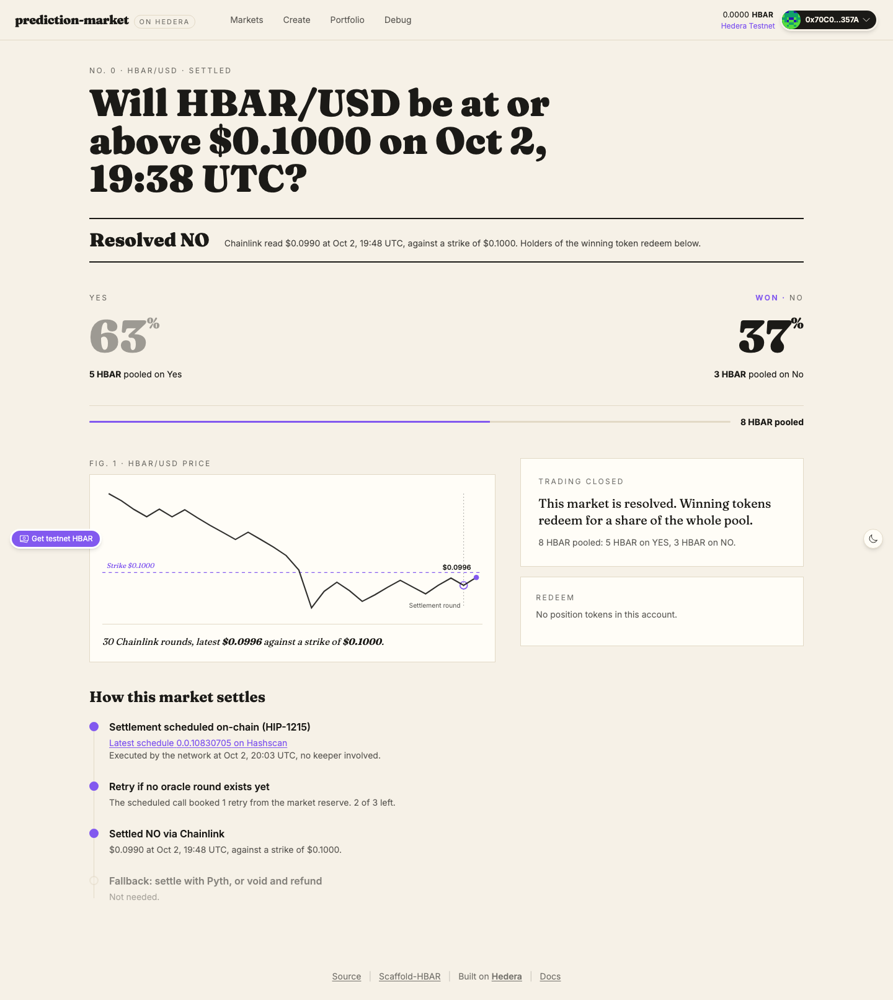
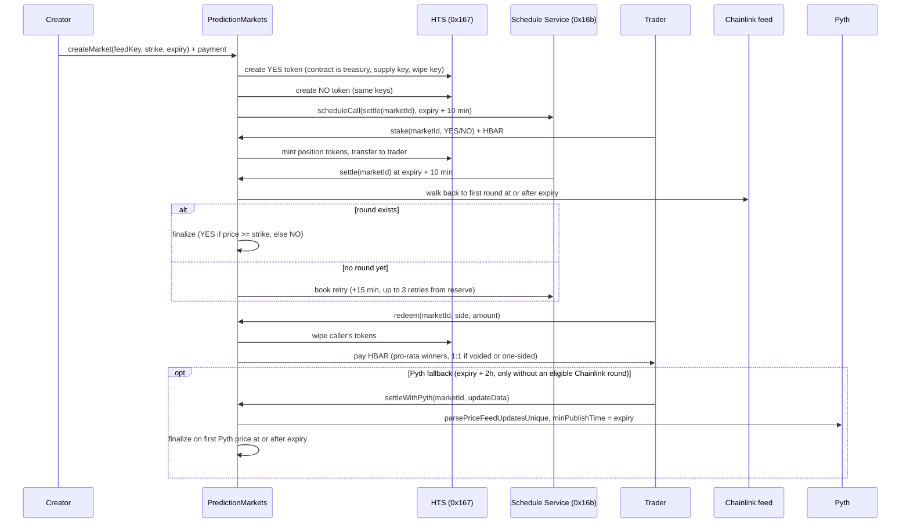

# Predera: prediction markets on Hedera (scaffold-hbar template)

Binary price prediction markets on Hedera. Anyone creates a market (for example "HBAR/USD at or above $0.30 at expiry"), traders stake HBAR on YES or NO and receive HTS position tokens, and the market settles itself through a scheduled contract call that reads a Chainlink feed. A Pyth fallback and a void path cover the failure cases. No keeper bot, no cron job.

```bash
npm create scaffold-hbar@latest -- --template superhbar/prediction-market
```



More screenshots: [an open market with the payout preview](docs/screenshots/market-open.png), [market list](docs/screenshots/markets.png), [create form](docs/screenshots/create.png), [mobile](docs/screenshots/market-detail-mobile.png), [light theme](docs/screenshots/market-detail-light.png). All are taken from the production build against the live testnet deployment.

## What you get

- `PredictionMarkets` contract: one contract holds every market and acts as treasury, supply key, and wipe key for all position tokens.
- HIP-1215 self-settlement: each market books its own `settle(marketId)` call on the Hedera Schedule Service (system contract `0x16b`) at creation, with self-booked retries.
- Chainlink push settlement plus Pyth pull fallback: settlement uses the first oracle price at or after expiry, never a cherry-picked price.
- HTS position tokens: one fungible token per side per market (8 decimals), minted 1:1 per staked tinybar, redeemed by wipe (no approve step).
- Frontend pages: market list with filters, create form with live Chainlink strike default, market detail (pools, odds, countdowns, stake, settle, void, redeem), portfolio, and the scaffold Debug Contracts page.
- Tests: 89 Foundry unit tests with mocked HTS and Schedule Service (100% line coverage, mutation-checked), plus 45 vitest tests for units, feeds, status, activity decoding and Hashscan helpers.
- E2E script: full lifecycle on real testnet (create, stake both sides, scheduled settle, redeem, reserve withdraw) that prints Hashscan links.
- Harness recipe: `.harness/` holds a spec, PRDs, and validators so Hedera Harness can build features against the same gate.

## Quick start

Prerequisites:

- Node.js >= 20.18.3.
- yarn (default) or npm. If you scaffolded with npm, replace `yarn <script>` below with `npm run <script>`.
- Foundry (`forge`, `cast`) for contract work. The frontend alone does not need it.
- A Hedera testnet account. Use the Hedera Portal (portal.hedera.com, 1000 HBAR per day), not the 10 HBAR per day faucet. Creating a market costs about 23 HBAR in HTS fees plus a 7 HBAR settlement reserve.

Run against the shipped testnet deployment (no deploy needed):

```bash
yarn install
yarn next:dev
```

Open http://localhost:3000. The frontend bindings in `packages/nextjs/contracts/deployedContracts.ts` already point at the live testnet deployment, so the app works before you deploy anything. Market 0 shows a finished lifecycle (settled NO after one self-booked retry). Markets 1, 2 and 3 (HBAR, BTC and ETH) stay open until 1 November, 31 October and 16 October 2026, so you can stake on them straight away.

Connect a wallet set to Hedera testnet (chain id 296, RPC https://testnet.hashio.io/api), for example MetaMask with the Hedera network added. For read-only browsing, no wallet is needed: every core route renders without one.

## Deploy your own

Create or import a deployer keystore, then fund its address with testnet HBAR. Sending HBAR to a new EVM address creates its Hedera account automatically.

```bash
yarn foundry:account:generate
yarn foundry:account:import
```

Deploy to Hedera testnet:

```bash
yarn foundry:deploy --network hedera_testnet --keystore <name>
```

Hedera deploys go through `packages/foundry/scripts-js/deployHedera.js` (`cast send --create`), because Foundry 1.8 `forge script` sends `eth_getTransactionCount` with an EIP-1898 block object that the Hashio relay rejects ("Invalid parameter 1"). The script writes the same `broadcast/` and `deployments/` records a forge broadcast would, then `generateTsAbis` regenerates `packages/nextjs/contracts/deployedContracts.ts`. Never edit that file by hand.

Then run the full lifecycle check on testnet (needs about 45 testnet HBAR):

```bash
DEPLOYER_PRIVATE_KEY=0x... yarn foundry:e2e:testnet
```

The script creates a six-minute market, stakes both sides, waits for the scheduled settlement, redeems, withdraws the reserve, and prints a Hashscan link for every step. It takes about 17 minutes when Chainlink publishes a round soon after expiry. Testnet feeds publish only on deviation or heartbeat, so a quiet feed can leave no round for hours. The script then walks the same fallbacks a user has: it waits out the self-booked retries, calls `settle` itself as soon as a round exists (until expiry + 2 hours), settles with Pyth when `PYTH_API_KEY` is set, and voids the market once the 24 hour grace period has passed. When none applies yet it prints the void time; resume with `yarn foundry:e2e:testnet --market <id>`.

## Environment variables

| Name | Where | Required? | Purpose |
|---|---|---|---|
| `NEXT_PUBLIC_HEDERA_TESTNET_RPC_URL` | `packages/nextjs/.env` | No (has a default) | JSON-RPC endpoint the frontend uses on testnet |
| `NEXT_PUBLIC_HEDERA_MAINNET_RPC_URL` | `packages/nextjs/.env` | No (has a default) | JSON-RPC endpoint the frontend uses on mainnet |
| `NEXT_PUBLIC_WALLET_CONNECT_PROJECT_ID` | `packages/nextjs/.env` | No (shared default for local testing; set your own for production) | WalletConnect project id for RainbowKit |
| `PYTH_API_KEY` | `packages/nextjs/.env` | No | Server-only key for the Pyth Hermes proxy at `app/api/pyth`. Without it the app runs fully and the fallback button explains how to enable it |
| `PYTH_HERMES_URL` | `packages/nextjs/.env` | No | Override for the Pyth Hermes endpoint (default https://hermes.pyth.network) |
| `HEDERA_RPC_URL` | `packages/foundry/.env` | No (has a default) | RPC used by fork tests (default https://testnet.hashio.io/api) |
| `LOCALHOST_KEYSTORE_ACCOUNT` | `packages/foundry/.env` | No (has a default) | Keystore used for localhost deploys |
| `DEPLOYER_PRIVATE_KEY` | env, e2e and automation only | Yes, for e2e | Funded testnet ECDSA key consumed by `yarn foundry:e2e:testnet`. Never commit it, never prefix it with `NEXT_PUBLIC_` |

Copy each `.env.example` to `.env` and fill in the values you need. `PYTH_API_KEY` must stay server-side: it is read only by the Next.js API route, never by client code.

## How it works

Every number below was measured on Hedera testnet. The full list, with what each measurement means for the code, is in [docs/hedera-notes.md](docs/hedera-notes.md).



### Market lifecycle

States are `Open`, `Settled`, and `Voided` (see `State` in `PredictionMarkets.sol`). Trading is open until `expiry`. After expiry the market waits for its scheduled settlement, then becomes `Settled` (with outcome YES, NO, or Invalid for one-sided markets) or, after a 24 hour grace period with no settlement, anyone can call `voidMarket` and it becomes `Voided`.

### Why the first round at or after expiry

Testnet Chainlink feeds update every 3 to 46 minutes (measured). The latest price at expiry can therefore be published before trading closes, which would let traders bet on a known outcome. Both oracle paths settle on the first price published at or after expiry, so the settlement price is always unknowable while trading is open.

The contract only settles on a Chainlink round it can prove is first: walking back from the latest round, it must reach an earlier round of the same phase published before expiry. If the walk stops first (its 48-step bound, a phase boundary, a missing round), it reports no eligible round instead of guessing, and the market moves on to a retry, the Pyth fallback, or voiding.

### Self-scheduling and retries (HIP-1215)

At creation the contract books `settle(marketId)` as a scheduled call for expiry plus 10 minutes through the Schedule Service at `0x16b`. Inside a scheduled call, `msg.sender` equals the contract itself, which is how `settle` knows it was invoked by the network. If no Chainlink round exists at or after expiry yet, the scheduled call books its own retry (plus 15 minutes, up to 3 retries) from the market's reserve instead of reverting. Anyone can also call `settle` directly once a round exists.

### Pyth fallback and voiding

Chainlink always has precedence, so nobody can choose whichever oracle favours their side. `settleWithPyth` opens 2 hours after expiry (`maxRoundLag`, when no later Chainlink round can still qualify), and only if no provably first Chainlink round exists; otherwise it reverts with `ChainlinkRoundAvailable`. It uses `parsePriceFeedUpdatesUnique` with `minPublishTime` set to expiry, so only the first Pyth price at or after expiry is accepted. The caller pays the Pyth update fee from `msg.value`; excess is refunded. After the 24 hour grace period, anyone can void an unsettled market and every position refunds 1:1.

Rounds more than 2 hours after expiry are rejected (`maxRoundLag`), so a market cannot settle on a price from hours later.

### Position tokens and redeem

Each market has a YES token and a NO token: HTS fungible tokens with 8 decimals, created by the contract, which holds treasury, supply key, and wipe key. Staking mints tokens equal to `msg.value` and transfers them to the staker. Redeem wipes the caller's tokens with the wipe key (HTS `burnToken` only burns from the treasury, so wiping is the correct primitive) and pays HBAR in the same transaction, with no approve step.

Payout equals `amount * totalPool / winningPool` and is read from the contract's `quotePayout`: the redeem amount the frontend shows is the number the contract pays. Before you stake, the form previews what the stake would pay if its side won at current pool sizes (`projectedPayout` in `utils/markets/units.ts`, the same formula); later stakes move that number. One-sided markets (only YES or only NO staked) and voided markets refund 1:1. Rounding dust from integer division stays in the contract.

### Units (tinybar vs weibar)

Wallets and JSON-RPC send weibar (18 decimals). Inside the EVM, `msg.value` and balances are tinybar (8 decimals); the relay converts. The contract never rescales. The frontend converts at one boundary in `packages/nextjs/utils/markets/units.ts`: it sends value with `parseEther(hbar)` and formats contract amounts with 8 decimals.

### Fees and the reserve

The network bills the contract for scheduled executions (a settle measured 127k gas, 0.104 HBAR at 82 tinybar per gas) and retry bookings (about 1.17 HBAR). Each market keeps its own reserve: 0.5 HBAR is charged per scheduled execution and 1.5 HBAR per retry. Creation requires at least 7 HBAR of reserve after the two HTS creation fees (about 23 HBAR total at the measured rate of $1 = 9.61 HBAR).

`totalPoolLiability` tracks HBAR owed to traders and `totalReserves` tracks the sum of market reserves, so `withdrawReserve` never pays out of trader pools. A fee underestimate is absorbed by that market's creator, never by traders.

If someone settles a market by hand before its booked schedule fires, the schedule still runs later and is still billed. So while a schedule is pending (`schedulePending`), `withdrawReserve` keeps one execution's cost (0.5 HBAR) in the reserve; the scheduled call returns quietly on a closed market, pays for itself from that holdback, and the creator can withdraw anything left afterwards.

## Architecture

```text
packages/foundry/
  contracts/PredictionMarkets.sol   One contract, all markets; treasury, supply key, wipe key
  contracts/libraries/PriceMath.sol Price normalization (Chainlink decimals, Pyth expo to 1e18)
  contracts/interfaces/             IAggregatorV3, IPyth, IHederaScheduleService, IHtsWipe
  script/Deploy.s.sol               Builds the deploy with HelperConfig; also encodes constructor args for deployHedera.js
  script/HelperConfig.s.sol         Single source for feeds (HBAR/BTC/ETH, testnet and mainnet) and timing config
  script/DeployHelpers.s.sol        Scaffold deploy runner
  test/PredictionMarkets.t.sol      State machine, oracles, payouts, reserve accounting, fuzz tests
  test/PriceMath.t.sol              Price normalization unit tests
  test/HelperConfig.t.sol           Feed and config tests per chain
  test/mocks/                       MockHTS, MockHSS (etched at 0x167/0x16b), MockAggregator, MockPyth
  scripts-js/deployHedera.js        Testnet and mainnet deploy via cast send --create (see Deploy your own)
  scripts-js/e2eTestnet.js          Full lifecycle run on real testnet with Hashscan links
  scripts-js/generateTsAbis.js      Regenerates packages/nextjs/contracts/deployedContracts.ts
packages/nextjs/
  app/page.tsx                      Market list with state filters
  app/markets/new/page.tsx          Create form, live Chainlink price as strike default
  app/markets/[id]/page.tsx         Market detail: pools, odds, countdowns, stake, settle, void, redeem
  app/portfolio/page.tsx            Positions across markets
  app/api/pyth/route.ts             Server-only Hermes proxy; PYTH_API_KEY never reaches the browser
  components/markets/               MarketCard, StakePanel, RedeemPanel, OddsBar, Countdown, PriceChart, SettlementTimeline, ActivityPanel, States, ui (shared badges and bars)
  styles/globals.css                Both daisyUI themes and the YES/NO colors: the whole look in one file
  utils/brand.ts                    App name, description and the theme colors that CSS cannot reach
  hooks/markets/                    useMarket, useMarkets, usePositions, useMarketConfig, useChainlinkHistory, useScheduleStatus, useFeedInfo, useCreationEstimate, useMarketActivity
  hooks/scaffold-hbar/              Scaffold read, write, event, and transactor hooks
  utils/markets/units.ts            The single tinybar and weibar conversion boundary, plus frontend gas limits
  utils/markets/feeds.ts            Feed keys and bytes32 conversion
  utils/markets/status.ts           Derives UI status (open, awaiting-settlement, retrying, settle-available, voidable, settled, voided)
  utils/markets/mirror.ts           Mirror node REST reads (exchange rate, account, token association, schedule status, contract logs)
  utils/markets/activity.ts         Decodes PredictionMarkets event logs into the activity panel rows
  utils/markets/hashscan.ts         Hashscan and entity id link builders
.harness/                           Harness recipe: spec, PRDs, validators (see Using Hedera Harness)
docs/hedera-notes.md                Hedera behaviour measured on testnet (units, HTS, HIP-1215, oracles, tooling)
docs/screenshots/                   Screenshots of the production build against the testnet deployment
```

## Testing

```bash
yarn foundry:test
yarn next:test
```

`yarn foundry:test` runs 89 unit tests. HTS and the Schedule Service are mocked with `vm.etch` at `0x167` and `0x16b`, Chainlink and Pyth use mocks, and a fuzz test proves winners never exceed the pool. Line coverage is 100 percent. `hedera-forking` does not emulate the Schedule Service, which is why HSS is mocked and the e2e script runs on real testnet instead.

`yarn next:test` runs vitest for units (including the pre-stake payout preview), feeds, status, Hashscan helpers and the HBAR price conversion. Redeem amounts come from the contract's own `quotePayout`.

Before pushing, also run the type and build gates:

```bash
yarn next:lint
yarn next:check-types
yarn next:build
```

## Verified on testnet

Live deployment: `PredictionMarkets` at `0x0cc41d2215C6e66caFF2C996b7FEEC162111B3d2` ([Hashscan](https://hashscan.io/testnet/contract/0x0cc41d2215C6e66caFF2C996b7FEEC162111B3d2)).

Full lifecycle run with `yarn foundry:e2e:testnet` on 2026-10-02 against the deployment above (contract source verified on Sourcify, exact match). The first scheduled settlement found no Chainlink round after expiry yet, so the contract booked its own retry, which then settled the market. No bot or keeper was involved at any step.

| Step | Evidence |
|---|---|
| Create market #0 (books the HIP-1215 settlement) | [transaction](https://hashscan.io/testnet/transaction/0x0aee085dbf4988cc6d128907b5a724fbdd6b7f561479affb9543780ab2a395e8) |
| YES and NO position tokens (HTS, created by the contract) | [0.0.10830520](https://hashscan.io/testnet/token/0.0.10830520), [0.0.10830521](https://hashscan.io/testnet/token/0.0.10830521) |
| Stake 5 HBAR on YES, 3 HBAR on NO | [YES](https://hashscan.io/testnet/transaction/0x3ace6113975ba9bc170e8ee3d734b4b941220d9c4bb48f2c8c026003728ea285), [NO](https://hashscan.io/testnet/transaction/0xc34327752495b176e7870af17e6c1d52640ad8bf61ab8c068e3eaf98b538910b) |
| Scheduled settlement, executed by the network, no round yet, so it booked a retry | [schedule 0.0.10830522](https://hashscan.io/testnet/schedule/0.0.10830522) |
| Self-booked retry, executed by the network, settled NO on Chainlink at $0.099035 | [schedule 0.0.10830705](https://hashscan.io/testnet/schedule/0.0.10830705) |
| Redeem the winning NO position (8 HBAR) | [transaction](https://hashscan.io/testnet/transaction/0xbbcf415f91f45c307537acbeecba6795105502e5d15238d97a8fa09f941bb889) |
| Creator withdraws the unused reserve | [transaction](https://hashscan.io/testnet/transaction/0x312ea637191036d60cf7823de275dd5bfe077471809bd279488920321bd4e04f) |

## Make it yours

The app is a working product, but every visual and naming decision sits in three files, so a fork can look like its own brand in minutes.

| What | Where |
|---|---|
| Name, short name, description, logo letter | `packages/nextjs/utils/brand.ts` (`BRAND`), used by the header, page metadata, web app manifest and wallet modal |
| Colors, radii, fonts | `packages/nextjs/styles/globals.css`: the dark `hedera` theme (default), the `hedera-light` theme, and the `--color-yes` / `--color-no` outcome colors in `@theme` |
| Font families | `packages/nextjs/app/layout.tsx` (`next/font` Inter and JetBrains Mono); swap them and keep the CSS variable names |
| Logo | `LogoMark` in `packages/nextjs/components/Header.tsx` |

Components only use semantic classes (`bg-base-100`, `text-primary`, `bg-yes`, `text-no`, `.panel`), never raw hex values, so editing a theme recolors every page, including the price chart, which draws with `var(--color-primary)` and `var(--color-secondary)`. Shared market UI (asset badge, status pill, YES/NO bar) lives in `packages/nextjs/components/markets/ui.tsx`.

Common changes:

- New palette: change `--color-primary`, `--color-secondary` and the base colors in both themes, then the matching hex values in `BRAND`.
- Light mode by default: set `defaultTheme="hedera-light"` on the `ThemeProvider` in `app/layout.tsx` and move `default: true` to the light theme in `globals.css`.
- Other assets: add a feed (see Add a price feed below). The question wording comes from `marketQuestion` in `packages/nextjs/utils/markets/question.ts`.

## Extending the template

### Add a price feed

1. Add the Chainlink address and Pyth price id in `packages/foundry/script/HelperConfig.s.sol` (`buildFeedKeys`, `buildFeeds`).
2. Add the key to `FEED_KEYS` in `packages/nextjs/utils/markets/feeds.ts`.
3. Redeploy (`yarn foundry:deploy --network hedera_testnet --keystore <name>`). Feeds are immutable after deploy, so existing markets keep the old set.

### Change the payout model

1. Change `quotePayout` in `packages/foundry/contracts/PredictionMarkets.sol`. It is the single payout definition: `redeem` pays exactly what it quotes.
2. Keep the invariant: total winner payouts never exceed `yesPool + noPool`. Extend the fuzz test in `packages/foundry/test/PredictionMarkets.t.sol` (`testFuzz_WinnersNeverExceedPool`) for the new math.
3. Redeem amounts in the frontend already come from `quotePayout`. Update the pre-stake preview, `projectedPayout` in `packages/nextjs/utils/markets/units.ts`, to the same formula, and its test in `units.test.ts`.

### Add a creator fee

1. Skim the fee in `stake` (grow the market reserve or a recorded fee balance, not a separate transfer).
2. Keep `totalPoolLiability` equal to HBAR owed to traders only, so `withdrawReserve` accounting still protects pools.
3. Surface the fee in the create form estimate (`packages/nextjs/hooks/markets/useCreationEstimate.ts`) and document it next to the reserve.

## Troubleshooting

| Symptom | Cause | Fix |
|---|---|---|
| `forge script` fails with "Invalid parameter 1" | Foundry 1.8 sends `eth_getTransactionCount` with an EIP-1898 block object that Hashio rejects | Deploy with `yarn foundry:deploy --network hedera_testnet --keystore <name>`, which routes through `scripts-js/deployHedera.js` (`cast send --create`) |
| Stake or create reverts with `INSUFFICIENT_GAS` or runs out of gas | Hashio gas estimation is unreliable for HTS and HSS calls | Use the explicit gas limits in `packages/nextjs/utils/markets/units.ts`: createMarket 3M, stake 1.5M, settle and settleWithPyth 1M, redeem 800k, voidMarket and withdrawReserve 300k |
| "Live price is unavailable" on the create form | Chainlink read failed or the feed address is wrong for the connected network | Check the network (testnet 296, mainnet 295), compare the address with `packages/foundry/script/HelperConfig.s.sol`, and retry. Creation still works with a manual strike |
| Market stuck awaiting settlement | No Chainlink round at or after expiry exists yet, or retries ran out | Wait for the next retry, call `settle` once a round exists, or use the Pyth fallback. After the 24 hour grace period anyone can void |
| "Settle with Pyth" button disabled or explains setup | `PYTH_API_KEY` is not set (Hermes requires an API key since 2026-08-26) | Set `PYTH_API_KEY` in `packages/nextjs/.env` and retry. Chainlink settlement and voiding work without it |
| Stake reverts with `TokenTransferFailed(184)` | Response code 184 is `TOKEN_NOT_ASSOCIATED_TO_ACCOUNT`: the staker's account has no free auto-association slot and is not associated with the position token | Use the one-click association prompt in the stake panel, then stake again. First stake per token per account costs about 0.65 HBAR (auto-association) versus about 0.04 HBAR normally |
| Balance too low after using the faucet | The faucet gives 10 HBAR per day; a market needs about 23 HBAR in token fees plus a 7 HBAR reserve | Get a Hedera Portal testnet account (portal.hedera.com, 1000 HBAR per day) |
| Wallet is on the wrong network | MetaMask points at mainnet or a local node while the app targets testnet | Switch the wallet to Hedera testnet (chain id 296, RPC https://testnet.hashio.io/api) and reload |

## Using Hedera Harness

[Hedera Harness](https://github.com/hedera-dev/hedera-harness) runs a coding agent against a recipe and only accepts the result when deterministic validators pass. This template ships its recipe in `.harness/`, and the market activity panel on every market page was built with it.

| File | What it does |
|---|---|
| `.harness/spec.yaml` | Recipe (schema v2): agent, baseline commands, validators, Tier 3 contract, Tier 3.5 chain validation |
| `.harness/prds/01-market-activity.md` | The feature brief, including the mirror node facts the agent needs (filter logs by `topics[1]` on the client) |
| `.harness/validators/static.json` | Tier 0: template shape, docs, forbidden env files, required feature files |
| `.harness/validators/yarn.json` | Tier 1: install, lint, type-check, vitest, forge tests, production build |
| `.harness/validators/playwright-smoke.yaml` | Tier 2: boots the app and loads `/`, `/markets/0`, `/markets/new`, `/portfolio` and a missing market with zero console errors. `/debug` is excluded: the upstream debug-contracts package calls CoinGecko itself |
| `.harness/acceptance-contract.json` | Tier 3: five numbered assertions graded against market 0's real testnet history |

Check the recipe and run the cheap tiers (no agent, no keys):

```bash
npx playwright@1.63.0 install chromium   # once, for the Tier 2 browser
yarn harness:doctor
yarn harness:validate
```

`harness:doctor` lists every missing piece for a full run (agent CLI, optional packages, operator env). `harness:validate` runs Tiers 0 to 2 and passes on `main`.

A full run needs the Tier 2 and Tier 3.5 extras next to the CLI, an agent CLI (`claude` by default), and an ECDSA testnet operator that funds a throwaway signer and gets the HBAR swept back at the end:

```bash
npm i -g hedera-harness@1.2.2 playwright @hiero-ledger/sdk
export HEDERA_OPERATOR_ID=0.0.xxxxx HEDERA_OPERATOR_KEY=0x...
hedera-harness run
```

### How the activity panel was built

- Run branch: [`harness/run-market-activity-674bcd`](https://github.com/superhbar/prediction-market/tree/harness/run-market-activity-674bcd), one commit per attempt.
- The nested `claude` CLI was not logged in on the build machine, so the run used the recipe's `generator:` override: OpenCode wrote the first pass, then agy (Claude Sonnet 4.6) took over when OpenCode's free model hit its rate limit. Tier 3 grading needs the same agent CLI, so it was done by hand; the results are below.
- Tier 3.5 provisioned a funded ephemeral account on every attempt and swept it back (for example `0.0.10831218`, `0.0.10831341`).
- The run ended with type-check, build, lint, tests and the static checks green, and one Tier 2 failure that was not the agent's code: the header balance and the HBAR price fetched CoinGecko and a second mirror host, which failed to resolve on the build machine. Both were fixed on `main` (the app now reads only the testnet mirror and the relay), and `yarn harness:validate` passes there with Tier 2 green on every gated route (all except `/debug`, see above).
- The generated decoder, hook, panel and 9 unit tests landed unchanged apart from one comment.

Tier 3 acceptance contract, graded by hand on the production build:

| Id | Assertion | Result |
|---|---|---|
| C1 | Market 0 lists created, two stakes, retry booked, settled NO, redeemed, reserve withdrawn, newest first, with correct amounts | Pass: 7 entries, 5 and 3 HBAR |
| C2 | Each entry links to the transaction that emitted it | Pass: every hash matches the mirror node logs, settlement is `0x9c2da867...` |
| C3 | Loading and error states, page keeps working | Pass by code review (skeleton, error with Retry, failures stay inside the panel) |
| C4 | Existing routes and the resolution strip still render | Pass |
| C5 | A new stake appears after a real transaction | Pass with the deployer as signer: [stake on market 1](https://hashscan.io/testnet/transaction/0x8b508cde06355e3acbc1e6f5439ef0b5048373f039e7fcbcd0122a94e841618e) showed up on refresh |

## Disclaimer

Unaudited and educational. Built testnet-first for learning the HTS, HIP-1215 scheduling, and oracle settlement pattern. Do not use with real funds or deploy to mainnet without a professional audit. Mainnet oracle addresses in `HelperConfig.s.sol` are present for reference only.

## License

MIT. See [LICENCE](LICENCE).
